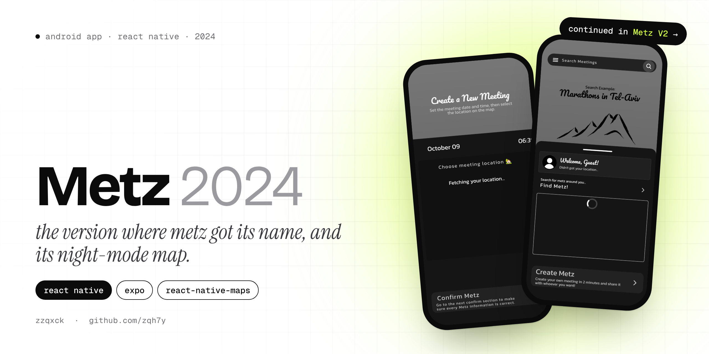
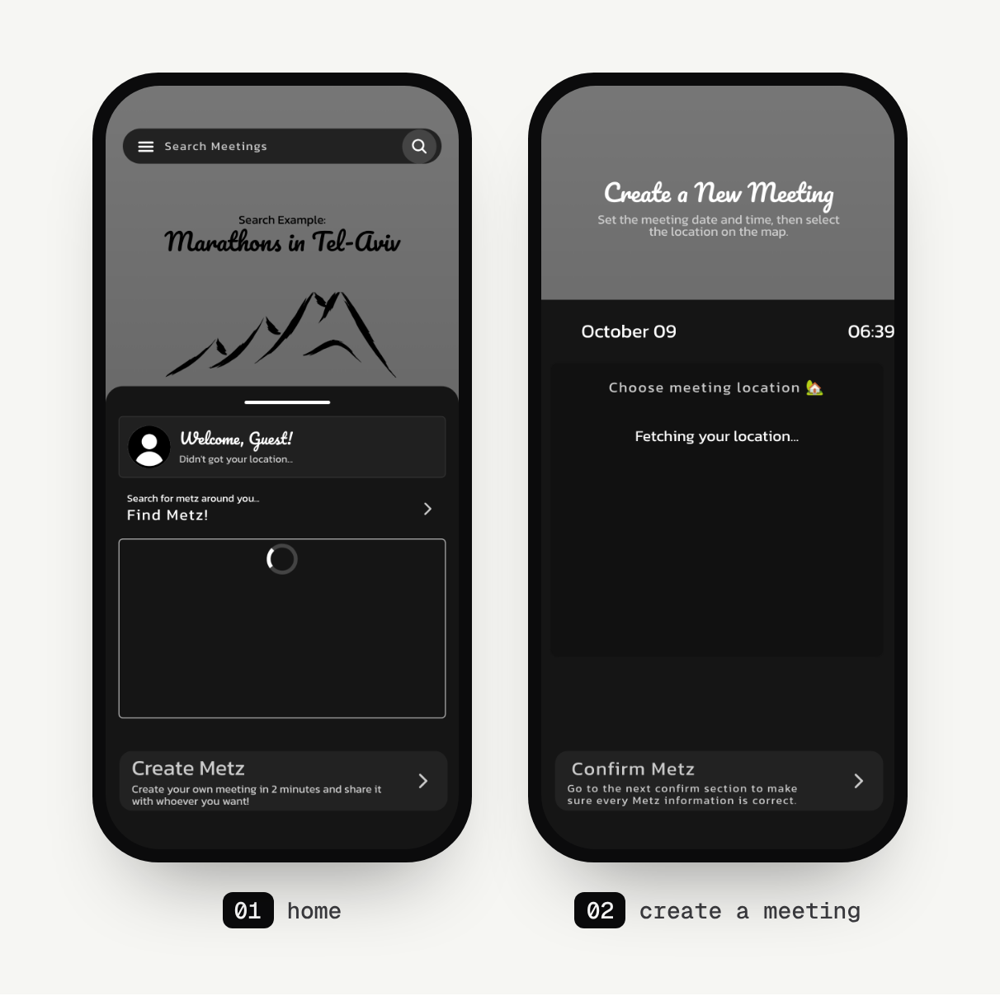

<p align="center">
  
</p>

<p align="center">
  
  
  
  
</p>

# Metz (2024)

Metz is my app idea about meetings: find things happening around you, create your own meeting in a couple of minutes, and share it with whoever you want. This repo is the **2024 version**, the one where the idea got the name Metz.

It was a comeback after several earlier apps on the same idea. It all started with [GetTogetherGo](https://github.com/zqh7y/GetTogetherGo), which never got published, and then [Poster](https://github.com/zqh7y/Poster), where I used SQLite without really understanding it yet. After about a year I started over with Metz, aiming to make it the go-to meetings app, at least in Israel.

> **This version isn't the current one.** Metz is now being built as **[Metz V2](https://github.com/zqh7y/MetzV2)**: a React Native app with a real API, a database, moderation and a second app for organisers. This repo stays up to show where it came from.

## Screens

<p align="center">
  
</p>

<sub>Rendered without a map provider, so the map areas are empty and the location isn't found. On a phone those boxes show the night-mode map.</sub>

The screenshots I posted while building it (October 2024):

<p align="center">
  
  &nbsp;&nbsp;
  
</p>

## What's in it

- **A night-mode map.** A custom dark map style (`src/MapData/NightModeStyle.jsx`) used on every map in the app.
- **Your location.** The app asks for location, centres the map on you and reverse-geocodes it to show your city and street.
- **Search** with a "Search Example" hero (*Marathons in Tel-Aviv*) and a set of sample searches.
- **Create a meeting** in two steps: pick the date and time, then drop a pin on the map. A **confirm** screen then shows the meeting on the map, with a **private meeting** switch and a shareable link you can copy.
- Custom fonts, gradients and a dark UI throughout.

## What I planned for it

These were the ideas for Metz back then. Some of them made it into Metz V2 in a different form.

- **AI suggestions** that find meetings you'd like based on what you did in the app, using the OpenAI API.
- **A web page for every meeting**, so you can send a link to a friend who doesn't have the app. If they do have it, the link opens the meeting inside the app. *(Metz V2 has this: a public share page where anyone can join with just a name.)*
- **Paid meetings**, so creators can charge for public meetings through the app.

The plan was a React Native frontend and a C# backend. The backend never made it into this repo.

## Tech

| Part | Tech |
|---|---|
| Framework | React Native 0.74, Expo SDK 51 (prebuilt `android/` project) |
| Navigation | React Navigation 6 (native stack) |
| Maps | `react-native-maps` with a custom night style |
| Location | `expo-location` (position and reverse geocoding) |
| UI | `expo-linear-gradient`, `expo-font`, `@expo/vector-icons` |

## Run it

```bash
git clone https://github.com/zqh7y/Metz.git
cd Metz
npm install
npx expo run:android
```

This version uses a prebuilt Android project and `react-native-maps`, so run it with `expo run:android` on an emulator or a phone rather than in Expo Go.

---

<p align="center">
  Made by <b>zzqxck</b> · <a href="https://zqh7y.github.io/Portfolio/">portfolio</a> · <a href="https://github.com/zqh7y">more projects</a>
</p>
